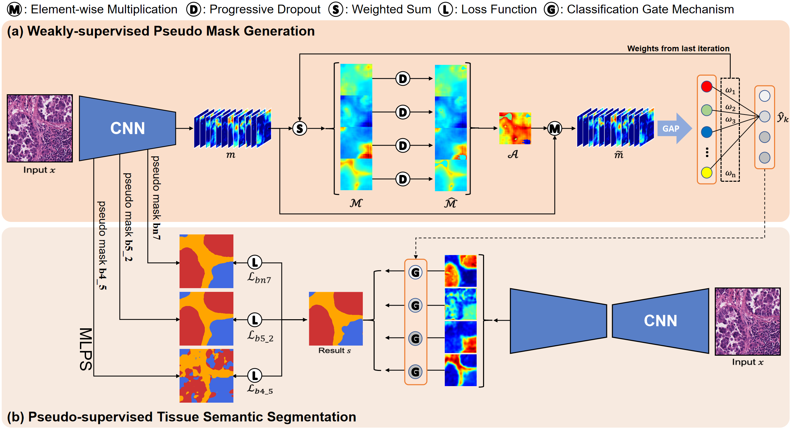

# Multi-Layer Pseudo-Supervision for Histopathology Tissue Semantic Segmentation using Patch-level Classification Labels


## Introduction
The implementation of **[Multi-Layer Pseudo-Supervision for Histopathology Tissue Semantic Segmentation using Patch-level Classification Labels](https://doi.org/10.1016/j.media.2022.102487)**.

## Abstract
Tissue-level semantic segmentation is a vital step in computational pathology. Fully-supervised models have already achieved outstanding performance with dense pixel-level annotations. However, drawing such labels on the giga-pixel whole slide images is extremely expensive and time-consuming. In this paper, we use only patch-level classification labels to achieve tissue semantic segmentation on histopathology images, finally reducing the annotation efforts. We propose a two-step model including a classification and a segmentation phases. In the classification phase, we propose a CAM-based model to generate pseudo masks by patch-level labels. In the segmentation phase, we achieve tissue semantic segmentation by our propose Multi-Layer Pseudo-Supervision. Several technical novelties have been proposed to reduce the information gap between pixel-level and patch-level annotations. As a part of this paper, we introduce a new weakly-supervised semantic segmentation (WSSS) dataset for lung adenocarcinoma (LUAD-HistoSeg). We conduct several experiments to evaluate our proposed model on two datasets. Our proposed model outperforms two state-of-the-art WSSS approaches. Note that we can achieve comparable quantitative and qualitative results with the fully-supervised model, with only around a 2% gap for MIoU and FwIoU. By comparing with manual labeling on a randomly sampled 100 patches dataset, patch-level labeling can greatly reduce the annotation time from hours to minutes.

## Dataset
We have released both datasets via Google Drive ([LUAD-HistoSeg](https://drive.google.com/drive/folders/1E3Yei3Or3xJXukHIybZAgochxfn6FJpr?usp=sharing) and [BCSS-WSSS](https://drive.google.com/drive/folders/1iS2Z0DsbACqGp7m6VDJbAcgzeXNEFr77?usp=sharing).).
We would like to thank Amgad et al. for this excellent dataset. The original BCSS dataset can be download at this link [BCSS-link](https://github.com/PathologyDataScience/CrowdsourcingDataset-Amgadetal2019).

## Requirements
- Python 3.7
- pytorch
- torchvision
- CUDA
- 1×CPU

## Prerequisite
* To train the stage1, you need to download the pretrained weight of the [Mxnet and ResNet-38](https://github.com/itijyou/ademxapp) model [[ilsvrc-cls_rna-a1_cls1000_ep-0001.params]](https://drive.google.com/file/d/1YB3DkHiBeUH5wn6shk93jChvXwfOxwBE/view?usp=sharing)
* To train the stage2, you need to download the pretrained weight of the [DeepLab V3+]([https://github.com/](https://arxiv.org/abs/1802.02611)) model [[...]](https://drive.google.com/)

## Usage
### Prerequisite
- To train the stage1 and stage2, you should download the pretrained weight of [ResNet-38](https://github.com/itijyou/ademxapp) and [DeepLab V3+](https://drive.google.com/) and put them in the **init_weights** folder.
- And you can download our datasets ([LUAD-HistoSeg](https://drive.google.com/drive/folders/1E3Yei3Or3xJXukHIybZAgochxfn6FJpr?usp=sharing) and [BCSS-WSSS](https://drive.google.com/drive/folders/1iS2Z0DsbACqGp7m6VDJbAcgzeXNEFr77?usp=sharing)) and unpack them into the **datasets** folder.

WSSS-Tissue/

    |_ datasets
    |     |_ BCSS-WSSS/
    |         |_ train/
    |         |_ val/
    |         |_ test/
    |     |_ LUAD-HistoSeg/
    |         |_ train/
    |         |_ val/
    |         |_ test/
   
### Run the whole pipeline
- In this work, our pipeline include 3 part~(Stage 1, PM generation, Stage2). You can directly run run_pipeline.sh to complete the three-part training and test.
- [Note] To run the whole pipeline, you need to specify the dataset related hyperparameters. Please see the command in run_pipeline.sh.
```
bash run_pipeline.sh
```
### Run each step: 
- The whole pipeline of our model includes the step of classification model training, muleti-layer pseudo masks  generation, and segmentation model training. You can use following scripts to run each step.
- [Note] Please specify the argument in the command. You can also check run_pipeline.sh to see more details.
#### 1、Train the classification model with the image-level label: 

```
python 1_train_stage1.py --dataset luad --trainroot datasets/LUAD-HistoSeg/train/ --testroot dataset/LUAD-HistoSeg/test/ --max_epoches 20 --batch_size 20
```
#### 2、Generate multi-layers pesudo mask by classification model: 

```
python 2_generate_PM.py --dataroot datasets/LUAD-HistoSeg --dataset luad --weights checkpoints/stage1_checkpoint_trained_on_luad.pth
```
#### 3、Train the segmentation model with multi-layer pesudo masks: 

```
python 3_train_stage2.py --dataset luad --dataroot datasets/LUAD-HistoSeg --epochs 20 -- Is_GM True --resume_stage1 checkpoints/stage1_checkpoint_trained_on_luad.pth --resume init_weights/deeplab-resnet.pth.tar
```

## Citation
If you find the code useful, please consider citing our paper using the following BibTeX entry.
```
@article{HAN2022102487,
title = {Multi-Layer Pseudo-Supervision for Histopathology Tissue Semantic Segmentation using Patch-level Classification Labels},
journal = {Medical Image Analysis},
pages = {102487},
year = {2022},
issn = {1361-8415},
doi = {https://doi.org/10.1016/j.media.2022.102487},
url = {https://www.sciencedirect.com/science/article/pii/S1361841522001347},
author = {Chu Han and Jiatai Lin and Jinhai Mai and Yi Wang and Qingling Zhang and Bingchao Zhao and Xin Chen and Xipeng Pan and Zhenwei Shi and Zeyan Xu and Su Yao and Lixu Yan and Huan Lin and Xiaomei Huang and Changhong Liang and Guoqiang Han and Zaiyi Liu}}
```
